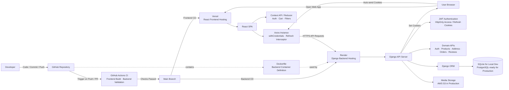

# PurePro | Full Stack eCommerce Web App

[](https://react.dev/)
[](https://www.djangoproject.com/)
[](https://github.com/features/actions)
[](https://vercel.com/)
[](https://render.com/)
[](https://www.docker.com/)

> Full-stack e-commerce web application built with React and Django.  
> Designed to simulate production-style service flows including cookie-based authentication, order snapshot handling, purchase-based reviews, backend validation tests, and deployable frontend/backend architecture.

---

## 🚀 Overview

PurePro is a full-stack eCommerce project built to simulate production-style service behavior rather than a simple shopping mall clone.

The project focuses on:

- cookie-based JWT authentication with refresh flow
- order creation with shipping and product snapshot storage
- purchase-based review policy
- backend validation of core business rules through automated tests
- separated frontend/backend deployment with CI/CD

---

## ✨ Core Features

### Authentication
- JWT authentication with HttpOnly access/refresh cookies
- automatic access token refresh with Axios interceptor
- protected session recovery through backend auth utility

### Product / Cart / Checkout
- product listing and detail pages
- cart state management with reducer-based updates
- checkout flow with saved addresses
- validation for invalid order requests

### Order Flow
- address ownership validation before order creation
- duplicate product validation inside cart items
- stock validation before order confirmation
- shipping fee calculation based on subtotal
- shipping and product snapshot storage at order time
- user-specific order history retrieval

### Review Flow
- only purchased users can create reviews
- one review per user per product
- users can update or delete only their own reviews
- product average rating and review count are recalculated automatically

---

## 🧠 Architecture Decisions

### Cookie-based JWT Authentication
Access and refresh tokens are stored in HttpOnly cookies to simulate a more production-oriented authentication flow and reduce direct token exposure in client-side JavaScript.

### Order Snapshot Design
Shipping information and product information are stored as snapshot values at the moment of order creation. This keeps historical order data consistent even if product data changes later.

### Purchase-based Review Policy
Reviews are restricted to users with purchase history for the target product. This makes the review system more reliable and closer to real commerce service behavior.

### Domain-based Backend Structure
Backend logic is separated by domain modules such as auth, orders, reviews, and products to improve readability and maintainability.

---

## 🧪 Testing

This project includes backend tests for core business logic and validation rules.

### Covered areas
- auth views
- order views
- review views
- review model
- validator utils
- auth utility

### What is tested
- signup, login, logout, and refresh flow
- access/refresh cookie handling
- unauthorized access blocking
- order validation and stock updates
- shipping fee calculation
- purchase-based review creation
- duplicate review prevention
- review rating aggregation logic
- validator boundary cases

### Example command
```bash
python manage.py test
```

---

## 🛠️ Tech Stack

### Frontend
- React
- React Router
- Context API + Reducer
- Axios
- SASS
- Swiper

### Backend
- Django
- Django ORM
- Django REST Framework
- Simple JWT
- Gunicorn
- Whitenoise
- django-storages / boto3

### DevOps / Deployment
- GitHub Actions
- Docker
- Vercel
- Render

---

## 🏗️ System Architecture



---

## 📁 Project Structure

```bash
react-ecommerce-project/
├── client/                  # React frontend
│   ├── public/
│   ├── src/
│   │   ├── api/
│   │   ├── components/
│   │   ├── contexts/
│   │   ├── data/
│   │   ├── hooks/
│   │   ├── pages/
│   │   └── routes/
│   ├── package.json
│   ├── vercel.json
│   └── README.md
│
├── server/                  # Django backend
│   ├── config/
│   ├── shop/
│   │   ├── migrations/
│   │   ├── models/
│   │   ├── views/
│   │   └── urls.py
│   ├── Dockerfile
│   ├── manage.py
│   ├── requirements.txt
│   └── README.md
│
├── .github/
│   └── workflows/
│       └── ci.yml
│
├── erd.mmd
└── systemArchitecture.mmd
```

---

## ⚙️ Getting Started

### 1. Clone the repository

```bash
git clone https://github.com/your-username/react-ecommerce-project.git
cd react-ecommerce-project
```

### 2. Frontend setup

```bash
cd client
npm install
npm start
```

Frontend runs on:

```bash
http://localhost:3000
```

### 3. Backend setup

```bash
cd server
pip install -r requirements.txt
python manage.py migrate
python manage.py runserver
```

Backend runs on:

```bash
http://127.0.0.1:8000
```

---

## 🔐 Environment Variables

Create environment files for frontend and backend as needed.

### Example frontend
```env
REACT_APP_API_URL=http://127.0.0.1:8000
```

### Example backend
```env
DJANGO_SECRET_KEY=your-secret-key
DJANGO_DEBUG=True
DJANGO_ALLOWED_HOSTS=127.0.0.1,localhost
CORS_ALLOWED_ORIGINS=http://127.0.0.1:3000,http://localhost:3000
CSRF_TRUSTED_ORIGINS=http://127.0.0.1:3000,http://localhost:3000
DATABASE_URL=sqlite:///db.sqlite3
```

Optional production-related values:

```env
AWS_ACCESS_KEY_ID=your-key
AWS_SECRET_ACCESS_KEY=your-secret
AWS_STORAGE_BUCKET_NAME=your-bucket
AWS_S3_REGION_NAME=your-region
```

---

## 🧪 CI Workflow

This project uses GitHub Actions to verify key application quality before deployment.

### Current checks
- frontend build
- backend validation
- backend automated tests for core service logic

### CI flow
1. Code is pushed to GitHub
2. GitHub Actions runs frontend and backend checks
3. Changes are merged only after required checks pass

---

## 🚢 CD / Deployment

This project uses continuous deployment for both frontend and backend.

### Frontend CD
- Vercel for React frontend hosting
- production frontend is deployed from the GitHub repository

### Backend CD
- Render for Django backend hosting
- backend is deployed using a Dockerfile-based containerized setup

### Deployment Summary
- CI: GitHub Actions
- CD: Vercel (frontend), Render (backend)

---

## 📌 Roadmap

- Standardize backend error response format
- Add admin dashboard for order / stock / review management
- Add backend-side filtering, sorting, and pagination
- Improve logging and monitoring
- Add API documentation

---

## 👨‍💻 Author

**Euiseok Jeong**  
- [LinkedIn](https://www.linkedin.com/in/euiseok-jeong-965b9b310)

---

## 📜 License

This project is for portfolio and educational purposes.
