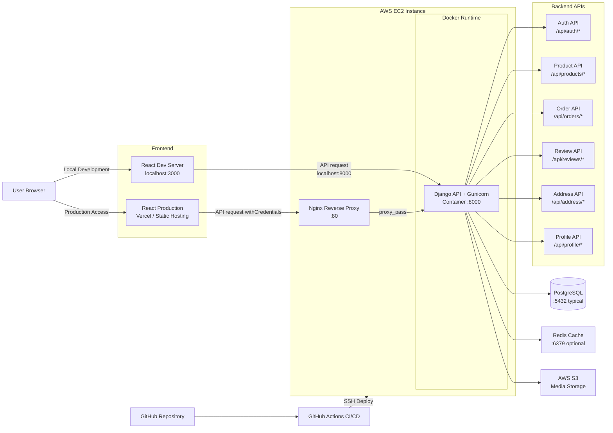

# PurePro | Full-Stack eCommerce Web App

[](https://react.dev/)
[](https://www.djangoproject.com/)
[](https://github.com/features/actions)
[](https://vercel.com/)
[](https://aws.amazon.com/ec2/)
[](https://www.docker.com/)
[](https://nginx.org/)

> Full-stack eCommerce web application built with React and Django.  
> Designed to simulate production-style service behavior including cookie-based authentication, automatic token refresh, order snapshot storage, purchase-based review policy, backend validation tests, and deployable frontend/backend architecture.

---

## 📚 Contents

- [🚀 Overview](#-overview)
- [✨ Core Features](#-core-features)
- [🧠 Architecture Decisions](#-architecture-decisions)
- [🏗️ System Architecture](#️-system-architecture)
- [🛠️ Tech Stack](#️-tech-stack)
- [📁 Project Structure](#-project-structure)
- [🔑 Authentication Flow](#-authentication-flow)
- [🛒 Order Flow](#-order-flow)
- [⭐ Review Policy](#-review-policy)
- [🧪 Testing](#-testing)
- [⚙️ Getting Started](#️-getting-started)
- [🔐 Environment Variables](#-environment-variables)
- [🐳 Docker](#-docker)
- [🧪 CI Workflow](#-ci-workflow)
- [🚢 CD / Deployment](#-cd--deployment)
- [📌 Future Improvements](#-future-improvements)
- [👨‍💻 Author](#-author)

---

## 🚀 Overview

PurePro is a full-stack eCommerce project built to simulate real service-side behavior rather than a simple shopping mall clone.

The project focuses on:

- cookie-based JWT authentication with HttpOnly cookies
- automatic access token refresh through an Axios interceptor
- address-based checkout and order validation
- order creation with product and shipping snapshot storage
- purchase-based review restrictions
- backend tests for core business rules
- separated frontend/backend deployment with CI/CD

---

## ✨ Core Features

### Authentication
- JWT authentication with HttpOnly access and refresh cookies
- automatic access token refresh when the access token expires
- protected route handling based on current user state
- Google login support on the frontend/backend flow

### Product / Cart / Checkout
- product list and product detail pages
- reducer-based cart state management
- checkout flow with saved address selection
- validation for invalid order requests before order creation

### Order Flow
- address ownership validation before order creation
- duplicate product validation inside order items
- stock validation before order confirmation
- shipping fee calculation based on subtotal
- order and order-item snapshot storage at purchase time
- user-specific order history retrieval

### Review Flow
- only users with purchase history can create reviews
- one review per user per product
- users can edit or delete only their own reviews
- average rating and review count are recalculated automatically

---

## 🧠 Architecture Decisions

### Cookie-based JWT Authentication
Access and refresh tokens are stored in HttpOnly cookies to support a more production-oriented authentication flow and reduce direct token exposure in client-side JavaScript.

### Order Snapshot Design
Shipping information and product information are stored as snapshot values at the time of order creation. This keeps historical order data consistent even if product data changes later.

### Purchase-based Review Policy
Reviews are restricted to users with purchase history for the target product. This makes the review system more reliable and closer to real commerce service behavior.

### Domain-based Backend Structure
Backend logic is separated by domain modules such as auth, products, addresses, orders, profile, and reviews for readability and maintainability.

---

## 🏗️ System Architecture



### Architecture Summary
- frontend development server runs on **3000**
- Django API server runs on **8000**
- production traffic enters through **Nginx :80**
- Django runs inside **Docker on AWS EC2**
- backend connects to **PostgreSQL**, **Redis**, and **AWS S3**
- deployment is automated with **GitHub Actions**

---

## 🛠️ Tech Stack

### Frontend
- React
- React Router
- Context API + Reducer
- Axios
- SASS
- Swiper

### Backend
- Django
- Django ORM
- Django REST Framework
- Simple JWT
- Gunicorn
- Whitenoise
- django-storages / boto3

### DevOps / Deployment
- GitHub Actions
- Docker
- AWS EC2
- Nginx
- Vercel
- PostgreSQL
- Redis
- AWS S3

---

## 📁 Project Structure

```bash
react-ecommerce-project-main/
├── client/                    # React frontend
│   ├── public/
│   ├── src/
│   │   ├── api/
│   │   ├── assets/
│   │   ├── components/
│   │   ├── contexts/
│   │   ├── data/
│   │   ├── hooks/
│   │   ├── pages/
│   │   ├── routes/
│   │   ├── sass/
│   │   ├── App.js
│   │   └── index.js
│   ├── package.json
│   ├── vercel.json
│   └── README.md
│
├── server/                    # Django backend
│   ├── config/
│   ├── nginx/
│   ├── shop/
│   │   ├── migrations/
│   │   ├── models/
│   │   ├── tests/
│   │   ├── utils/
│   │   ├── views/
│   │   └── urls.py
│   ├── Dockerfile
│   ├── entrypoint.sh
│   ├── manage.py
│   ├── README.md
│   └── requirements.txt
│
├── .github/
│   └── workflows/
│       ├── ci.yml
│       └── deploy.yml
│
├── deploy.sh
├── erd.mmd
├── systemArchitecture.mmd
└── README.md
```

---

## 🔑 Authentication Flow

Authentication is implemented using JWT stored in HttpOnly cookies.

### Flow
1. user logs in through the frontend
2. backend issues access and refresh tokens
3. tokens are stored in HttpOnly cookies
4. frontend sends authenticated requests with `withCredentials: true`
5. when the access token expires, Axios interceptor requests `/api/auth/refresh/`
6. backend validates the refresh token and reissues a new access token
7. frontend retries the original request automatically

This approach is closer to a deployable service flow than storing tokens directly in local storage.

---

## 🛒 Order Flow

The order system is designed around request validation and data consistency.

### Main backend checks
- current user validation
- address ownership validation
- duplicate product validation in one order
- stock validation before order creation
- shipping fee calculation
- atomic order creation
- product stock reduction after successful order creation

### Snapshot strategy
At order time, the backend stores:
- shipping information snapshot
- product title snapshot
- product price snapshot
- product image snapshot

This keeps historical order records stable even if product data changes later.

---

## ⭐ Review Policy

The review system is designed to behave more like a real commerce service.

### Rules
- only authenticated users can create reviews
- only users with eligible purchase history can create reviews
- one user can write only one review per product
- users can update or delete only their own reviews
- average rating and review count are recalculated automatically

---

## 🧪 Testing

This project includes backend tests for core business logic and validation rules.

### Covered areas
- auth views
- order views
- review views
- review model
- validator utils
- auth utility

### What is tested
- signup, login, logout, and refresh flow
- access and refresh cookie handling
- unauthorized access blocking
- order validation and stock updates
- shipping fee calculation
- purchase-based review creation
- duplicate review prevention
- review rating aggregation logic
- validator boundary cases

### Example command
```bash
cd server
python manage.py test
```

---

## ⚙️ Getting Started

### 1. Clone the repository

```bash
git clone https://github.com/your-username/react-ecommerce-project.git
cd react-ecommerce-project-main
```

### 2. Frontend setup

```bash
cd client
npm install
npm start
```

Frontend runs on:

```bash
http://localhost:3000
```

### 3. Backend setup

```bash
cd server
pip install -r requirements.txt
python manage.py migrate
python manage.py runserver
```

Backend runs on:

```bash
http://127.0.0.1:8000
```

---

## 🔐 Environment Variables

Create environment files for frontend and backend as needed.

### Example frontend

```env
REACT_APP_API_URL=http://127.0.0.1:8000
REACT_APP_GOOGLE_CLIENT_ID=your-google-client-id
```

### Example backend

```env
DJANGO_SECRET_KEY=your-secret-key
DJANGO_DEBUG=True
DJANGO_ALLOWED_HOSTS=127.0.0.1,localhost
CORS_ALLOWED_ORIGINS=http://127.0.0.1:3000,http://localhost:3000
CSRF_TRUSTED_ORIGINS=http://127.0.0.1:3000,http://localhost:3000
DATABASE_URL=sqlite:///db.sqlite3
```

### Optional production-related values

```env
AWS_ACCESS_KEY_ID=your-key
AWS_SECRET_ACCESS_KEY=your-secret
AWS_STORAGE_BUCKET_NAME=your-bucket
AWS_S3_REGION_NAME=your-region
REDIS_URL=redis://host:6379/1
GOOGLE_CLIENT_ID=your-google-client-id
```

---

## 🐳 Docker

This project includes a backend Dockerfile for container-based deployment.

### Build backend image

```bash
cd server
docker build -t purepro-backend .
```

### Run backend container

```bash
docker run -p 8000:8000 purepro-backend
```

---

## 🧪 CI Workflow

This project uses GitHub Actions to verify backend quality before deployment.

### Current checks
- frontend dependency install and build
- backend dependency install
- migration consistency check
- Django system check
- automated backend test execution

### CI summary
- **CI**: GitHub Actions
- validates frontend build health and backend service logic before deployment

---

## 🚢 CD / Deployment

This project uses a split deployment strategy.

### Frontend deployment
- React frontend is deployed separately
- production frontend can be hosted on **Vercel**

### Backend deployment
- backend is deployed to **AWS EC2**
- GitHub Actions connects to EC2 through SSH
- latest code is pulled on the EC2 instance
- Docker image is rebuilt on EC2
- Django runs with Gunicorn inside a container on port `8000`
- Nginx receives external requests on port `80` and proxies them to the backend container

### Deployment summary
- **CI**: GitHub Actions
- **CD**: GitHub Actions + EC2 SSH deployment
- **Reverse Proxy**: Nginx
- **Containerization**: Docker
- **App Server**: Gunicorn
- **Backend Hosting**: AWS EC2
- **Frontend Hosting**: Vercel or static hosting

---

## 📌 Future Improvements

- standardize backend error response format
- improve CSRF handling for cookie-based auth flows
- refine serializer and validation structure
- add pagination, filtering, and sorting improvements
- improve logging and monitoring
- add API documentation
- persist cart state more robustly on the frontend

---

## 👨‍💻 Author

**Euiseok Jeong**  
- [LinkedIn](https://www.linkedin.com/in/euiseok-jeong-965b9b310)
