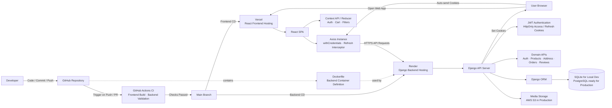

# PurePro | Full Stack eCommerce Web App

[](https://react.dev/)
[](https://www.djangoproject.com/)
[](https://github.com/features/actions)
[](https://vercel.com/)
[](https://render.com/)
[](https://www.docker.com/)

> 🛒 Full stack protein store eCommerce web application built with **React** and **Django**.  
> Includes authentication, product browsing, cart, address management, orders, reviews, **GitHub Actions-based CI**, and **continuous deployment with Vercel (frontend) and Render (backend)**.

---

## 🚀 Overview

PurePro is a full stack eCommerce project designed to simulate a modern online store experience.

The project is built with:

- **Frontend**: React SPA with Context API and Reducer-based state management
- **Backend**: Django API server organised by domain modules
- **Authentication**: JWT with HttpOnly access/refresh cookies
- **Database**: SQLite for local development, PostgreSQL-ready for production
- **CI**: GitHub Actions for frontend build and backend validation
- **CD**: Vercel for frontend deployment and Render for backend deployment
- **Containerization**: Dockerfile-based backend deployment on Render

---

## ✨ Core Features

- 🔐 User authentication with HttpOnly cookie-based JWT flow
- 🛍️ Product list and product detail pages
- 🛒 Cart management
- 📦 Address management
- 🧾 Order creation and order history
- ⭐ Review creation, update, and deletion
- ✅ Purchase-based review policy
- 🎯 Product filtering and sorting
- 🌙 Responsive dark-themed UI
- 🔄 Access token refresh with Axios interceptor
- 🐳 Dockerfile-based backend containerization
- ⚙️ GitHub Actions CI workflow
- 🚀 Continuous deployment with Vercel (frontend) and Render (backend)

---

## 🛠️ Tech Stack

### Frontend
- **React**
- **React Router**
- **Context API + Reducer**
- **Axios**
- **SASS**
- **Swiper**

### Backend
- **Django**
- **Django ORM**
- **Django REST Framework**
- **Simple JWT**
- **Gunicorn**
- **Whitenoise**
- **django-storages / boto3**

### DevOps / Deployment
- **GitHub Actions** (CI)
- **Docker** (backend containerization)
- **Vercel** (frontend CD)
- **Render** (backend CD)

---

## 🏗️ System Architecture



---

## 📁 Project Structure

```bash
react-ecommerce-project/
├── client/                  # React frontend
│   ├── public/
│   ├── src/
│   │   ├── api/
│   │   ├── components/
│   │   ├── contexts/
│   │   ├── data/
│   │   ├── hooks/
│   │   ├── pages/
│   │   └── routes/
│   ├── package.json
│   ├── vercel.json
│   └── README.md
│
├── server/                  # Django backend
│   ├── config/
│   ├── shop/
│   │   ├── migrations/
│   │   ├── models/
│   │   ├── views/
│   │   └── urls.py
│   ├── Dockerfile
│   ├── manage.py
│   ├── requirements.txt
│   └── README.md
│
├── .github/
│   └── workflows/
│       └── ci.yml
│
├── erd.mmd
└── systemArchitecture.mmd
```

---

## ⚙️ Getting Started

### 1. Clone the repository

```bash
git clone https://github.com/your-username/react-ecommerce-project.git
cd react-ecommerce-project
```

### 2. Frontend setup

```bash
cd client
npm install
npm start
```

Frontend runs on:

```bash
http://localhost:3000
```

### 3. Backend setup

```bash
cd server
pip install -r requirements.txt
python manage.py migrate
python manage.py runserver
```

Backend runs on:

```bash
http://127.0.0.1:8000
```

---

## 🔐 Environment Variables

Create environment files for frontend and backend as needed.

### Example frontend
```env
REACT_APP_API_URL=http://127.0.0.1:8000
```

### Example backend
```env
DJANGO_SECRET_KEY=your-secret-key
DJANGO_DEBUG=True
DJANGO_ALLOWED_HOSTS=127.0.0.1,localhost
CORS_ALLOWED_ORIGINS=http://127.0.0.1:3000,http://localhost:3000
CSRF_TRUSTED_ORIGINS=http://127.0.0.1:3000,http://localhost:3000
DATABASE_URL=sqlite:///db.sqlite3
```

Optional production-related values:

```env
AWS_ACCESS_KEY_ID=your-key
AWS_SECRET_ACCESS_KEY=your-secret
AWS_STORAGE_BUCKET_NAME=your-bucket
AWS_S3_REGION_NAME=your-region
```

---

## 🧪 CI Workflow

This project uses GitHub Actions for continuous integration.

### Current checks
- Frontend build
- Backend validation

### CI flow
1. Code is pushed to GitHub
2. GitHub Actions runs frontend and backend checks
3. Changes are merged only after required checks pass

---

## 🚢 CD / Deployment

This project uses continuous deployment for both frontend and backend.

### Frontend CD
- **Vercel** for React frontend hosting
- Production frontend is deployed from the GitHub repository

### Backend CD
- **Render** for Django backend hosting
- Backend is deployed using a **Dockerfile-based containerized setup**

### Deployment Summary
- **CI**: GitHub Actions
- **CD**: Vercel (frontend), Render (backend)

---

## 📌 Roadmap

- Improve frontend lint compliance without CI workaround
- Add test coverage for core backend flows
- Add backend-side filtering, sorting, and pagination
- Improve admin management features
- Refine cart persistence
- Enhance deployment automation

---

## 👨‍💻 Author

**Euiseok Jeong**  
- [LinkedIn](https://www.linkedin.com/in/euiseok-jeong-965b9b310)

---

## 📜 License

This project is for portfolio and educational purposes.
