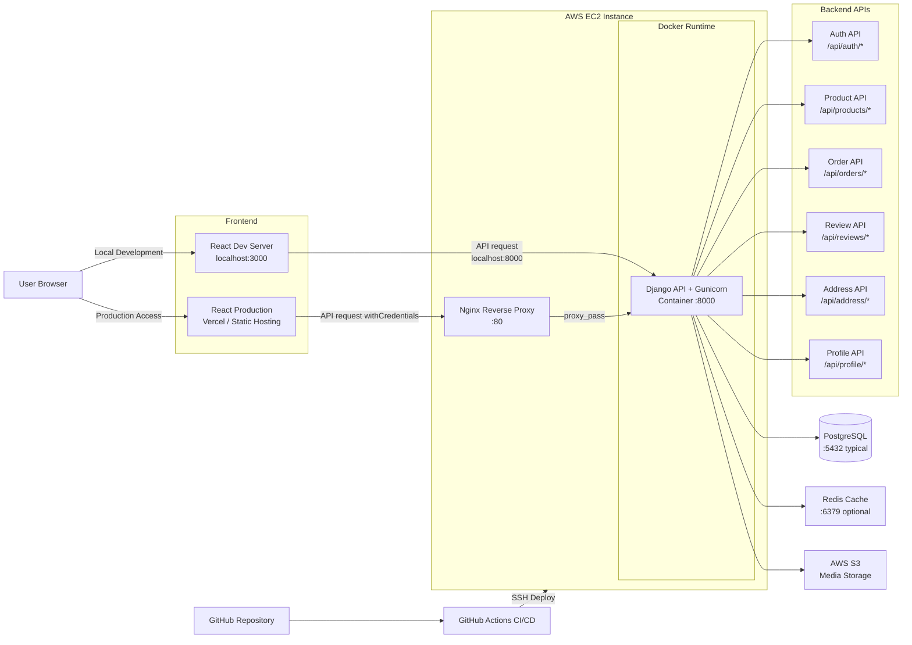

# PurePro Backend | Django eCommerce API

[](https://www.djangoproject.com/)
[](https://github.com/features/actions)
[](https://aws.amazon.com/ec2/)
[](https://www.docker.com/)
[](https://nginx.org/)

> Django backend API for the PurePro eCommerce project.  
> Designed to handle production-style service flows including cookie-based authentication, order snapshot storage, purchase-based review policy, automated backend testing, and containerized deployment on AWS EC2.

---

## 📚 Contents

- [🚀 Overview](#-overview)
- [✨ Core Backend Responsibilities](#-core-backend-responsibilities)
- [🧠 Architecture Decisions](#-architecture-decisions)
- [🏗️ System Architecture](#️-system-architecture)
- [🛠️ Technologies Used](#️-technologies-used)
- [📁 Backend Structure](#-backend-structure)
- [🔑 Authentication Flow](#-authentication-flow)
- [📦 Domain Modules](#-domain-modules)
- [🗃️ Data Model Highlights](#️-data-model-highlights)
- [🧪 Testing](#-testing)
- [⚙️ Local Development](#️-local-development)
- [🔐 Environment Variables](#-environment-variables)
- [🐳 Docker](#-docker)
- [🧪 CI Workflow](#-ci-workflow)
- [🚢 CD / Deployment](#-cd--deployment)
- [📌 Future Improvements](#-future-improvements)
- [👨‍💻 Author](#-author)

---

## 🚀 Overview

This backend was built to support more than simple CRUD endpoints.
It focuses on service-side rules that are common in real commerce systems, such as authentication recovery, order consistency, purchase validation, and review reliability.

The backend covers:

- JWT authentication with HttpOnly access and refresh cookies
- auth, product, address, profile, order, and review APIs
- order creation with shipping and product snapshot storage
- purchase-based review restriction
- domain-based module separation
- automated tests for core business rules
- Docker-based deployment on AWS EC2

---

## ✨ Core Backend Responsibilities

### Authentication
- signup, login, logout, refresh, and current-user endpoints
- JWT stored in HttpOnly cookies
- access token recovery through backend auth utility

### Product & Profile APIs
- product list and detail APIs
- profile data retrieval for the authenticated user

### Address APIs
- create, update, delete, and default-address handling
- ownership-based access control for user addresses

### Order APIs
- order creation with request validation
- address ownership validation before order creation
- duplicate product validation inside order items
- stock validation before confirming an order
- shipping fee calculation based on subtotal
- user-specific order history retrieval
- shipping and product snapshot storage at order time

### Review APIs
- create, update, delete, and list review endpoints
- only purchased users can create reviews
- one review per user per product
- average rating and review count are recalculated automatically

---

## 🧠 Architecture Decisions

### Cookie-based JWT Authentication
The backend uses HttpOnly cookies for access and refresh tokens to support a more production-oriented authentication flow and reduce direct exposure of tokens in client-side JavaScript.

### Order Snapshot Design
At the time of order creation, shipping information and product information are stored as snapshot values. This ensures historical order data remains stable even if product information changes later.

### Purchase-based Review Policy
Review creation is restricted to users with eligible purchase history. This prevents arbitrary review creation and makes the review system more reliable.

### Domain-based Backend Structure
The backend is organized by domain modules such as auth, products, addresses, orders, profile, and reviews. This improves readability and makes feature-specific maintenance easier.

---

## 🏗️ System Architecture



### Summary
- frontend development server runs on **3000**
- Django API server runs on **8000**
- production requests enter through **Nginx :80**
- Django runs inside **Docker on AWS EC2**
- backend connects to **PostgreSQL**, **Redis**, and **AWS S3**
- deployment is automated with **GitHub Actions**

---

## 🛠️ Technologies Used

- Django
- Django ORM
- Django REST Framework
- Simple JWT
- Gunicorn
- Whitenoise
- django-storages
- boto3
- Docker
- GitHub Actions
- AWS EC2
- Nginx
- PostgreSQL
- Redis
- AWS S3

---

## 📁 Backend Structure

```bash
server/
├── config/
│   ├── settings/
│   │   ├── base.py
│   │   ├── local.py
│   │   └── prod.py
│   ├── urls.py
│   └── wsgi.py
│
├── nginx/
│   └── default.conf
│
├── shop/
│   ├── migrations/
│   ├── models/
│   │   ├── __init__.py
│   │   ├── address.py
│   │   ├── order.py
│   │   ├── product.py
│   │   ├── review.py
│   │   └── user.py
│   │
│   ├── tests/
│   │   ├── test_auth_utils.py
│   │   ├── test_auth_views.py
│   │   ├── test_order_views.py
│   │   ├── test_review_model.py
│   │   ├── test_review_views.py
│   │   └── test_validators.py
│   │
│   ├── utils/
│   ├── views/
│   │   ├── address_views.py
│   │   ├── auth_views.py
│   │   ├── order_views.py
│   │   ├── product_views.py
│   │   ├── profile_views.py
│   │   └── review_views.py
│   │
│   ├── admin.py
│   ├── apps.py
│   └── urls.py
│
├── Dockerfile
├── entrypoint.sh
├── manage.py
├── README.md
├── requirements.txt
└── upload_images.py
```

---

## 🔑 Authentication Flow

Authentication is implemented using JWT stored in HttpOnly cookies.

### Flow
1. user logs in
2. backend issues access and refresh tokens
3. tokens are stored in HttpOnly cookies
4. frontend sends authenticated requests with `withCredentials: true`
5. when the access token expires, frontend requests `/api/auth/refresh/`
6. backend validates the refresh token and reissues a new access token

This approach is closer to a deployable service flow than storing tokens directly in local storage.

---

## 📦 Domain Modules

### Auth
- signup
- login
- logout
- token refresh
- current user info
- Google login handling

### Products
- product list
- product detail
- product images

### Address
- create address
- update address
- delete address
- set default address

### Orders
- create order
- get order history
- order item snapshot handling
- shipping fee calculation
- stock validation
- ownership and duplicate-item validation

### Reviews
- create review
- update review
- delete review
- get product reviews
- get my reviews
- purchase-based review restriction

### Profile
- current user profile data
- update basic user profile information

---

## 🗃️ Data Model Highlights

Main entities:

- **User**
- **Product**
- **ProductImage**
- **Address**
- **Order**
- **OrderItem**
- **Review**

### Key design points
- order data stores **snapshot values**
- review access is controlled by **purchase history**
- review model updates **avg_rating** and **review_count** automatically
- order creation validates **stock**, **duplicates**, and **address ownership**
- backend is organized by **domain-based modules**

---

## 🧪 Testing

This backend includes tests for core business logic, model behavior, and validation utilities.

### Covered areas
- auth views
- order views
- review views
- review model
- validator utils
- auth utility

### What is tested
- signup, login, logout, and refresh flow
- access and refresh cookie handling
- unauthorized access blocking
- order validation and stock updates
- shipping fee calculation
- purchase-based review creation
- duplicate review prevention
- review rating aggregation and deletion behavior
- validator boundary cases
- current-user resolution from access token

### Example command
```bash
python manage.py test
```

---

## ⚙️ Local Development

### Install dependencies

```bash
pip install -r requirements.txt
```

### Apply migrations

```bash
python manage.py migrate
```

### Run development server

```bash
python manage.py runserver
```

Backend default local URL:

```bash
http://127.0.0.1:8000
```

---

## 🔐 Environment Variables

Example `.env` values:

```env
DJANGO_SECRET_KEY=your-secret-key
DJANGO_DEBUG=True
DJANGO_ALLOWED_HOSTS=127.0.0.1,localhost
CORS_ALLOWED_ORIGINS=http://127.0.0.1:3000,http://localhost:3000
CSRF_TRUSTED_ORIGINS=http://127.0.0.1:3000,http://localhost:3000
DATABASE_URL=sqlite:///db.sqlite3
```

Optional production-related values:

```env
AWS_ACCESS_KEY_ID=your-key
AWS_SECRET_ACCESS_KEY=your-secret
AWS_STORAGE_BUCKET_NAME=your-bucket
AWS_S3_REGION_NAME=your-region
REDIS_URL=redis://host:6379/1
GOOGLE_CLIENT_ID=your-google-client-id
```

---

## 🐳 Docker

This backend includes a Dockerfile for container-based deployment.

### Build image

```bash
docker build -t purepro-backend .
```

### Run container

```bash
docker run -p 8000:8000 purepro-backend
```

---

## 🧪 CI Workflow

This backend uses GitHub Actions to verify backend quality before deployment.

### Current backend checks
- dependency install
- migration consistency check
- Django system check
- automated backend test execution

### CI summary
- **CI**: GitHub Actions
- validates backend project health and core service logic before deployment

---

## 🚢 CD / Deployment

This backend is deployed to **AWS EC2** using a **Docker-based setup**.

### Backend deployment flow
- GitHub Actions connects to EC2 through SSH
- the latest code is pulled from GitHub
- Docker image is rebuilt on the EC2 instance
- Django runs with Gunicorn inside a container on port `8000`
- Nginx receives external requests on port `80` and proxies them to the backend container

### Deployment summary
- **CI**: GitHub Actions
- **CD**: GitHub Actions + EC2 SSH deployment
- **Reverse Proxy**: Nginx
- **Containerization**: Docker
- **App Server**: Gunicorn
- **Hosting**: AWS EC2

---

## 📌 Future Improvements

- standardize backend error response format
- improve CSRF handling for cookie-based auth flows
- improve serializer and validation structure
- optimize filtering, sorting, and pagination
- improve logging and monitoring
- add API documentation
- add more explicit permission and response standardization

---

## 👨‍💻 Author

**Euiseok Jeong**  
- [LinkedIn](https://www.linkedin.com/in/euiseok-jeong-965b9b310)
